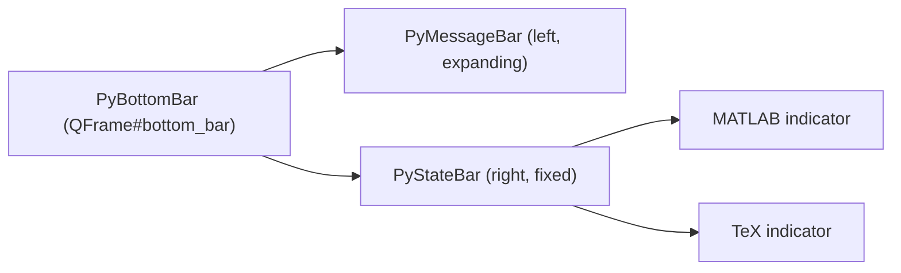

# Bottom Bar 说明

本文档说明 MyGUI 底部状态栏（Bottom Bar）的组成、消息传递逻辑、功能状态显示逻辑，以及当前限制。

## 总体结构

Bottom Bar 现在是一个父容器，内部由左右两个子组件组成：



涉及文件：

- `code/widgets/bottom_bar/py_bottom_bar.py`：父容器 `PyBottomBar`，组合 Message Bar 与 State Bar，并集中登记 State Bar 要显示的功能（`_feature_indicators()`）。
- `code/widgets/bottom_bar/py_message_bar.py`：`PyMessageBar`，负责左侧消息显示。
- `code/widgets/bottom_bar/py_state_bar.py`：`PyStateBar` 与 `FeatureIndicator`，负责右侧功能启用状态显示。
- `code/widgets/bottom_bar/style.qss`：底栏、消息区、状态区与指示器样式。
- `code/status_messages.py`：模块级消息 handler，业务代码通过它把消息传给底栏。
- `code/tex_config.py`：TeX 全局启用状态与监听机制。
- `code/database/matlab_adapter.py`：MATLAB 全局启用状态与监听机制。

## Message Bar（左侧）

Message Bar 承接原来 Bottom Bar 的全部消息功能，行为不变：

- `show_message(message, level)`：`info` 白色、`error` 红色、`success` 绿色。
- `show_error(message)` / `show_success(message)` / `clear_message()`。
- 完整消息同时写入 tooltip，单行不换行显示。

业务代码不直接引用 Message Bar，而是通过 `code/status_messages.py` 传递：

- 启动时 `status_messages.set_status_handler(bottom_bar.show_message)` 注册 handler。`PyBottomBar` 保留 `show_message` 等方法并转发给内部的 `PyMessageBar`。
- 任意模块调用 `status_messages.show_error("...")` 等函数即可把消息送到底栏，无需持有底栏引用。
- 窗口关闭时 `status_messages.clear_status_handler(...)` 注销 handler。

## State Bar（右侧）

State Bar 显示可选功能的启用状态：启用为绿色，未启用为红色。目前包含 MATLAB 和 TeX。

启用语义：

- MATLAB：用户通过 “Connect Matlab” 成功连接后为启用；连接失败或断开重置为未启用。状态保存在 `matlab_adapter` 的全局变量中。
- TeX：`matplotlib` 的 `text.usetex` 为真时为启用，对应 TeX 面板 `Use Latex Engine` 勾选并通过运行时检查。

状态更新通过监听机制驱动：

- `matlab_adapter.set_matlab_enabled(...)` 与 `tex_config.set_tex_enabled(...)` 在状态变化时通知已注册的监听器。
- State Bar 为每个功能注册一个监听器；收到通知后经内部 `state_changed` 信号在 GUI 线程更新对应指示器的颜色，避免后台线程直接操作控件。
- 颜色通过 QSS 动态属性 `state="on"/"off"` 控制。

### 可扩展性

新增一个功能状态指示器只需两步：

1. 让该功能模块提供三样东西：一个查询函数 `is_xxx_enabled()`、一对监听器注册/注销函数（在状态变化时通知 `Callable[[bool], None]`）。
2. 在 `py_bottom_bar.py` 的 `_feature_indicators()` 中追加一条 `FeatureIndicator`：

```python
FeatureIndicator(
    name="xxx",
    label="XXX",
    is_enabled=xxx_module.is_xxx_enabled,
    register_listener=xxx_module.register_xxx_state_listener,
    unregister_listener=xxx_module.unregister_xxx_state_listener,
),
```

State Bar 会自动为其创建指示器、设置初始颜色并随状态变化更新，无需改动 `PyStateBar` 本身。

## 当前限制

- State Bar 只显示布尔式启用/未启用两态，不显示“连接中”“检查中”等中间态或错误详情；这类过程信息仍通过 Message Bar 显示。
- MATLAB 启用状态表示“用户是否已成功连接”，不表示 MATLAB 运行时当前是否仍然可用；连接后若外部运行时失效，指示器不会自动变红。
- MATLAB 启用状态是进程级全局单值，多个 MATLAB 面板/连接不做区分，只反映最近一次连接结果。
- 启用状态不做持久化；每次启动进程时 MATLAB 与 TeX 均从未启用开始。
- State Bar 指示器仅用于状态展示，不可点击，不提供打开对应设置面板等交互。
- 指示器颜色为固定的绿/红，未适配色觉障碍的替代标识（如形状或文字）。
- State Bar 宽度随指示器数量增长，与 Message Bar 共享底栏固定宽度；功能数量较多时会挤占消息显示空间。
