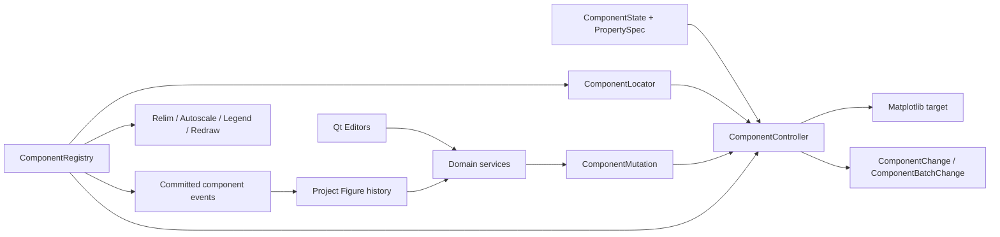

# Matplotlib Component Controllers

The component-controller layer under `mygui/figuremodify/components/` provides Qt-independent control of a Matplotlib Figure. Concrete Controller classes live in `mygui/figuremodify/components/controllers/` and stay exported from `mygui.figuremodify.components`. Domain Services are implemented in `mygui/figuremodify/services/` and re-exported from `mygui.figuremodify.component_services`. The layer separates artist behavior, serializable state, semantic lookup, hierarchy, and redraw coordination so GUI editors, project restore, scripted changes, and project Undo/Redo can call the same API.

## Architecture



`FigureHistoryService` is a Qt-facing orchestration layer above this graph. It
captures immutable before/after `ComponentState` deltas at explicit
user-intent boundaries and pushes them to the `TableRepository` project's
shared `QUndoStack`. Commands retain no Artist, Controller, QWidget, or Figure.
Replay uses the same Controllers and Services; structural changes additionally
use component materializers and `DeletionCoordinator` with stable IDs. See
[Project Undo and Redo](undo-redo.md).

The public value types are:

- `ComponentState`: serializable `id`, `kind`, `role`, `parent_id`, `order`, `selector`, `properties`, and `data`.
- `PropertySpec`: property type, default, normalizer, validator, editor hint, persistence flag, getter/setter, and `UpdateImpact`.
- `ComponentChange`: before/after snapshots, property key, `ChangeStatus`, impacts, and user-facing message.
- `ComponentMutation`: one atomic properties/data/runtime-drawable candidate.
- `ComponentBatchChange`: the committed or rejected result of a multi-component transaction.
- `ComponentEvent`: committed `ADDED`, `CHANGED`, or `REMOVED` lifecycle notification used by Editors.
- `ChangeStatus`: `APPLIED`, `EMPTY`, `REJECTED`, `DELETED`, or `NOOP`.
- `DeletionPolicy`: runtime-only `REMOVE`, `HIDE`, or `FORBID` authority
  declared by each Controller type.
- `RemovalHandle`: runtime-only capture of the exact target, owner, position,
  callbacks, and update subject used by reversible physical removal.
- `DeletionRequest`, `DeletionPlan`, `PreparedDeletion`, and
  `DeletionOutcome`: runtime-only two-phase deletion values; they are never
  serialized into `ComponentState` or schema v23.
- `UpdateImpact`: composable `RELIM`, `AUTOSCALE`, `LEGEND`, and `REDRAW` flags.

`ComponentController` exposes:

- `resolve_target()` and `read_state()`;
- `set_property(key, value)` for one validated transactional edit;
- `apply_mutation(mutation)` for an atomic property, persistent-data, and drawable-data edit;
- `apply_state(state)`, `snapshot()`, and `restore(snapshot)`;
- idempotent `delete()`, routed by `DeletionPolicy`;
- `prepare_remove()`, `commit_remove(handle)`, and
  `rollback_remove(handle)` for identity-preserving physical removal.

A rejected operation restores the previous target and state. Controllers report an `EMPTY` result when a valid data-bound component has no drawable rows.

## Registry and target resolution

`ComponentRegistry` owns Controllers and their parent/child relationships. It supports:

- `register()`, `get()`, `children()`, `descendants()`, and cycle-safe
  `ancestor(component_id, kind=...)` lookup;
- filtered `query(kind=..., role=..., capabilities=..., parent_id=..., recursive=...)`;
- multi-component `snapshot()` and transactional `restore()`;
- `apply_transaction()` and transactional `set_properties()` with artist/state rollback and buffered events;
- `delete_transaction(component_ids, state_replacements=(), verifier=None)`
  for atomic subtree deletion, survivor reindexing, and tree validation;
- event and batch subscription for Editor synchronization, tree projection,
  and cleanup;
- `registration_transaction()` for atomic publication of a new artist,
  Controller subtree, Locator binding, Inspector preflight, events, and
  pending redraw work;
- `batch_updates()` to coalesce relimit, autoscale, legend refresh, and one final draw.

After a coalesced `RELIM` or `AUTOSCALE`, the Registry reads the affected
Axes back into its `AxesController`. If the limits or autoscale state changed,
it emits a state-only `CHANGED` event so an open Common Inspector immediately
matches the canvas. This synchronization event has no `ComponentChange` and
therefore does not create a user-facing success message.

`ComponentLocator` weakly binds stable artists by component ID. Axes, Axis, Spine, Text, and stable Line/Scatter targets can also resolve through their parent and selector. Tick, Tick Label, Grid, and Legend Controllers resolve semantically each time because Matplotlib may recreate their underlying artists.

Deletion is a Registry structure transaction. It prepares every removable
root, buffers survivor changes and events, detaches the original artist/Axes
and Locator bindings reversibly, validates the Registry tree plus supplied
candidate verifiers, and commits only after all checks pass. Failure restores
the same Controllers, targets, Locator bindings, Matplotlib container order,
pending updates, and Controller state;
cleanup and lifecycle listeners see no intermediate event. Success marks and
unbinds the removed subtree, runs cleanup, emits child-first `REMOVED`
events, publishes survivor `CHANGED` events, and schedules at most one paint
per Figure. A paint failure after commit is a warning and does not claim that
the committed deletion was rolled back.

The first-party deletion policies are:

| Policy | Components |
| --- | --- |
| `REMOVE` | Axes, every Line role, Scatter, Colorbar, Secondary Axis, free Text, Annotation |
| `HIDE` | Axis, Spine, Tick, Tick Label, Grid, Title, axis labels, Legend |
| `FORBID` | Figure and the default for a new Controller type |

Axes use a specialized Matplotlib 3.9 removal handle. Its reversible stage
preserves `_localaxes`, `_axstack`, current Axes, mouse grabber, callbacks,
and shared/twinned relationships without firing `_axes_change_event`.
Matplotlib receives one Axes-change notification only after commit.

Colorbar uses a separate reversible handle that preserves the same Colorbar
and auxiliary-Axes identities, Figure Axes ordering, owner Axes layout and
anchor, source ScalarMappable callback registry, and Locator binding. An Axes
root composes these handles so Colorbar auxiliary Axes cannot outlive the owner
subtree.

`register_figure_components()` builds a complete Controller tree for an existing Figure. `create_semantic_children()` adds the fixed Axis, Spine, Tick, Tick Label, Grid, Title, Axis Label, and Legend records for an Axes. Callers can inject an `id_factory(path)` to produce deterministic project IDs.

## Controller families and properties

| Controller family | Roles | Persistent properties |
| --- | --- | --- |
| `FigureController` | Figure | identity/style, size/DPI, frame/edge/face appearance, alpha/linewidth, and tagged `layout` |
| `AxesController` | Axes | ordered limits, margins, aspect/box geometry, autoscale, anchor/adjustable, frame/layering/layout, and `color_cycle` |
| `XAxisController`, `YAxisController` | X/Y Axis | tagged `scale`, major/minor locator and formatter, label/offset-text configuration, and overlap handling |
| `SpineController` | Spine | visibility, position/bounds, line pattern/cap/join, antialiasing, layering, clipping/raster/export fields |
| `TickGroupController` | Major/Minor Tick | primary/secondary-side visibility, direction/geometry/color, antialiasing, layering, clipping/raster fields; no label `pad` |
| `TickLabelGroupController` | Major/Minor Tick Label | primary/secondary-side visibility, the sole `pad`, full safe typography/text-box configuration, layering and render/export fields |
| `GridController` | Grid | visibility, line pattern/gap/cap/join, antialiasing and clipping/raster fields; effective ordering comes from Axes `axisbelow` |
| `TextController` | Title, Axis Label, Text | text/visibility/position plus full safe typography, text box, rotation/alignment, render, layering and export configuration |
| `AnnotationController` | Annotation | independent target/text coordinate pairs, optional persistent arrow patch, text/box appearance, requested TeX state, layering, and clipping |
| `LegendController` | Legend | tagged location/anchor, layout/spacing, entry/title fonts, frame styling, draggable policy, layering and export configuration |
| `LineController` | Line and all curve roles | label/color, tagged line pattern/marker/markevery, draw/fill style, cap/join/gap, antialiasing, layering and safe export fields |
| `ScatterController` | Scatter | uniform face/edge styling, marker/line/hatch, tagged color/size mapping and norm, non-finite policy, layering and safe export fields |
| `ReferenceMarksController` | Reflection Positions | ordered finite positions, optional Table `position_ref`, tagged `placement`, Axes-relative baseline/height, uniform line appearance, visibility, layering, and clipping |
| `ReferenceLineController` | Reference Line | finite constant value, vertical/horizontal orientation, Axes-fraction span, uniform line appearance, visibility, layering, and clipping |
| `ReferenceBandController` | Reference Band | finite ordered bounds, vertical/horizontal orientation, Axes-fraction span, fill/border appearance, visibility, layering, and clipping |
| `ColorbarController` | Colorbar | visibility/label, constructor-sensitive placement, extend/spacing/edges, tagged locator/formatter, minor ticks/tick side, fonts, and outline appearance |
| `SecondaryAxisController` | Secondary X/Y Axis | reversible unit transform, parent-relative placement, label, ticker/tick/offset-text appearance, and spine appearance; no independent data, limits, or scale |
| `ZoomInAxesController`, `ImageInAxesController` | Zoom/Image inset | child-Axes placement and frame plus zoom connectors/range or embedded-image data |

The exact schema-v23 ownership matrix and tagged-value formats are maintained
in [`component-properties-v23.md`](component-properties-v23.md). Colorbar
controls and defaults are listed in
[`colorbar-component.md`](colorbar-component.md).
Axes do not persist scales, Axis does not persist inversion or side visibility,
and Tick groups do not persist label padding; those single-owner boundaries are
part of the project format.

`FunctionCurveController`, `DataPlotController`, `FitCurveController`, and `InterpolationController` specialize `LineController` with role-specific data. `controller_type_for(state)` and `create_controller(state, ...)` dispatch from the controlled kind/role pair (`registry_bridge.py` inside the controllers package).

Role data is validated by the Controller as well as by project IO:

- generic `line`: finite one-dimensional `x` and `y` arrays with equal length;
- `function_curve`: a non-empty, safe expression using `x`, plus finite `x_start` and `x_stop`;
- `data_plot` and `scatter`: complete `x_ref` and `y_ref` column references
  plus the persisted X/Y `preprocess` expressions;
- `reflection_positions`: exactly one ordered finite `positions` sequence;
  empty and duplicate values remain valid;
- `reference_line` and `reference_band`: exactly empty `{}` data; constant
  geometry belongs to their closed property contracts;
- `secondary_x_axis` and `secondary_y_axis`: exactly empty `{}` data; mapping
  and placement belong to the closed property contract;
- `interpolation`: references and preprocessing expressions, a registered
  method, integer `k` from 1 through 5, `samples` from 2 through 100000,
  Boolean `lam_auto`, and a non-negative finite optional `lam`;
- `fit_curve`: references and preprocessing expressions, `Python` or `Matlab`
  engine, fit metadata, a safe optional display expression, and finite display
  bounds.

An empty resolved data array is valid and keeps its Controller, editor, references, and project state. A malformed state or invalid replacement is rejected without changing the last valid artist or state.

## Domain services and Editors

Domain service implementations live in `mygui/figuremodify/services/`.
`mygui.figuremodify.component_services` remains the stable import facade
and re-exports application commands that span Controller or repository
boundaries:

| Module | Commands |
| --- | --- |
| `services/axes_command.py` | `AxesCommandService` |
| `services/chart_data.py` | `FunctionCurveService`, `ChartDataService`, `InterpolationService`, `FitService` |
| `services/colorbar.py` | `ColorbarService` |
| `services/secondary_axis.py` | `SecondaryAxisService` |
| `services/reference_marks.py` | `ReferenceMarksService`, `ReferenceGuideService` |
| `services/text_render.py` | `TextRenderService` |
| `services/annotation.py` | `AnnotationService` |
| `services/deletion.py` | `ComponentDeletionService`, `DeletionHandlerRegistry`, request/plan types |
| `services/dependency.py` | `ComponentDependencyService` |

- `AxesCommandService`: semantic Axis/Spine/Label/Legend commands and ordered palette application;
- `FunctionCurveService`: safe expression evaluation and atomic curve-data replacement;
- `ChartDataService`: Plot/Scatter reference changes and automatic table refresh;
- `ColorbarService`: source resolution, transactional creation/reconstruction,
  source refresh, and lifecycle coordination without copying Scatter mapping
  state;
- `SecondaryAxisService`: parent-Axes validation, unique normalized placement,
  reversible unit-transform creation/rebuild, scale-domain health refresh, and
  lifecycle coordination without an independent Axes data store;
- `ReferenceMarksService`: transactional one-collection creation, verified
  geometry/style edits, and complete ordered-position replacement;
- `ReferenceGuideService`: ordinary-Axes validation, staged Line/Poly
  collection creation with `autolim=False`, blended-transform geometry,
  render verification, and atomic property rollback;
- `InterpolationService`: validated interpolation configuration and refresh;
- `FitService`: persistent fit results, manual-refit generations, and display-range updates;
- `TextRenderService`: synchronous render verification with rollback and glyph warnings;
- `AnnotationService`: the only Inspector/history entry for Annotation
  property and full-state mutation, delegating render-sensitive checks to
  `TextRenderService`;
- `ComponentDeletionService`: stable-ID planning, subtree ownership checks,
  explicit handler resolution, Axes reindexing, and palette deletion effects;
- `DeletionHandlerRegistry`: one exact physical-deletion contract for every
  production `REMOVE` Controller key, validated during Canvas startup;
- `ComponentDependencyService`: capture/delete/restore of table-bound
  component snapshots together with exact parent Axes palette state.

These services do not maintain parallel project records. `ComponentRegistry` and `ComponentState` are the only runtime truth. The visible panels receive an `EditorContext`, call Controllers/services directly, and are synchronized or removed through committed Registry events. `Py*Modify` façade classes are not part of the architecture.

The Canvas host package is `mygui/widgets/figure_canvas/`. Public `add_*` and
`restore_component_tree` stay on `PyFigureCanvas` in the historical filename
`py_figure_canves.py`. Batch staging (`ChartCreationStager`), restore handlers
(`canvas_materialize_handlers.py`), snapshot apply (`CanvasSnapshotApplier`),
the Canvas Window (`canvas_popout.py`), and the project navigation toolbar
(`canvas_toolbar.py`) hold only a host reference and must not cache
`ComponentState`, selection, or color-cycle state.

Production editors use one `ComponentInspector` shell. `EditorProfile` declares
the ordered `EditorSection` composition, explicit placement, and UI-only tree
presentation for an exact `EditorKey` kind/role pair, while
`PropertySection` generates an ordered subset of Controller `PropertySpec`
controls. `register_production_profiles()` installs all first-party mappings,
and `ComponentEditorManager.create()` is the production create-and-track
entry. `EditorRegistry` resolves profiles before custom editor factories.
`ComponentEditorBase` is available only when explicitly selected by tests or
non-production tooling; production profile resolution fails closed. Line roles share one
appearance section, Text roles share one render-verified section set, Legend
reuses only its intersecting title/font-size fields, and Axes pages bind their
semantic child Controllers. See `docs/component-inspector.md` for the complete
profile and parameter reference.

`TextRenderService.apply_many()` applies multiple Text or Annotation patches in one Registry
transaction and verifies rendering once per affected Figure. A TeX validation
or draw failure rolls every text-like Artist and Controller state back together.

`MessagePresenter` maps Controller results to the application Message Bar.
Editors explicitly present domain-specific results. It also observes committed
Registry changes and, on the next Qt event-loop turn, presents any successful
change that no caller consumed. Explicit and event-driven presentations are
deduplicated, related batch changes are coalesced, rejected results remain
immediate errors, and `NOOP` remains silent.

The Data Plot creation dialog initializes its line style from
`DataPlotController.default_properties()["linestyle"]`. It displays readable
labels (`Solid`, `Dashed`, `Dash-dot`, and `Dotted`) while passing and
persisting the canonical Matplotlib values (`-`, `--`, `-.`, and `:`).

## State and property example

```python
from mygui.figuremodify.components import (
    ComponentKind,
    ComponentRole,
    ComponentState,
    DataPlotController,
)

state = ComponentState(
    id="plot-1",
    kind=ComponentKind.LINE,
    role=ComponentRole.DATA_PLOT,
    parent_id="axes-1",
    order=0,
    selector={"object_id": "plot-1"},
    properties=DataPlotController.default_properties(),
    data={"x_ref": x_ref.to_dict(), "y_ref": y_ref.to_dict()},
)

controller = DataPlotController(state, target=line)
change = controller.set_property("linestyle", "--")
if change.ok:
    saved_state = controller.snapshot()
```

Use `ColorChoiceWidget` with the application-injected `ColorLibrary` for visible color editors. The Controller receives the normalized selected color and remains independent of Qt.

## Template for adding a Component

1. Add the new `ComponentKind` and `ComponentRole` values, then register the allowed pairing in `ROLES_BY_KIND`.
2. Derive a Controller from the nearest family. Declare `KIND`, accepted
   `ROLES`, `PROPERTY_SPECS`, capability names, and an explicit
   `DELETION_POLICY`.
3. Implement only target-specific hooks: selector validation, property
   read/write overrides, `_apply_data()`, empty-state detection, or
   `prepare_remove`/`commit_remove`/`rollback_remove` when `REMOVE` cannot use
   the normal Matplotlib artist-list handle.
4. Add stable binding or a semantic resolver in `ComponentLocator`. Prefer semantic selectors for Matplotlib objects that may be recreated.
5. Register the `(kind, role)` to Controller mapping in `CONTROLLER_TYPES`.
6. If the policy is `REMOVE`, register exactly one `DeletionHandler` for the
   same key. Leaf handlers reject registered children; a composite handler
   must own the full subtree and declare palette effects explicitly.
7. Create the `ComponentState` with a stable ID, valid parent, deterministic `order`, selector, default properties, and role data; register parents before children.
8. Add a domain-service command only when work crosses Controller boundaries or needs repository/render integration. Do not introduce a second mutable record.
9. Extend strict schema-v23 serialization and direct save/open round-trip coverage when the component is persistent. Any later persisted-field change requires a new schema version task.
10. Register an exact `EditorProfile` with explicit placement,
   `TreePresentationSpec`, and unique `SectionSpec` keys. Add a new Section
   only for a genuinely new interaction, inject `EditorContext` and the
   application `ColorLibrary`, and keep QWidget state out of `ComponentState`.
11. Add Controller contract tests for resolve, read/write, rejection
    rollback, snapshot/restore, deletion policy, same-object removal rollback,
    event invisibility, and coalesced redraw.

Minimal Controller shape:

```python
class ExampleController(ComponentController[ExampleArtist]):
    KIND = ComponentKind.EXAMPLE
    ROLES = frozenset({ComponentRole.EXAMPLE})
    DELETION_POLICY = DeletionPolicy.REMOVE
    PROPERTY_SPECS = (
        PropertySpec(
            "visible",
            bool,
            True,
            editor="check",
            impact=UpdateImpact.REDRAW,
        ),
        PropertySpec(
            "color",
            str,
            "#000000",
            editor="color",
            normalizer=normalize_color,
            impact=UpdateImpact.LEGEND | UpdateImpact.REDRAW,
        ),
    )
    CAPABILITIES = frozenset({"example", "color"})

    def _validate_candidate(self, state):
        if "name" not in state.selector:
            raise ComponentValidationError("Example selector requires name.")

    def _apply_data(self, target, state):
        target.set_data(state.data["values"])
```

The new state must continue to use the same eight-field JSON record and must not place QWidget objects, Matplotlib artists, NumPy arrays, or other runtime-only objects in `properties` or `data`.
